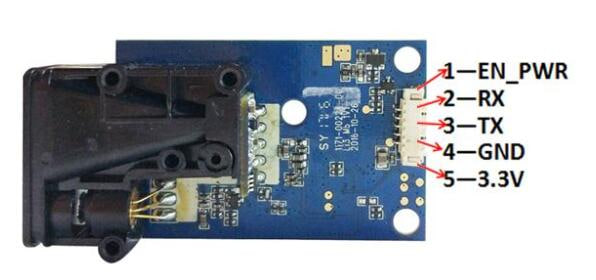

# TW10S-UART test program

Here you can find [datasheet](./datasheet.pdf). Where written that you can use 3 types of protocol, but only 1 way is working:

Send byte array like ```0x01 0x03 0x00 0x0F 0x00 0x02 0xF4 0x08``` and its just single measurement as its written on [arduino](https://forum.arduino.cc/t/sending-receiving-laser-sensor-data/964759) forum.

For continuous mesurement you should use next command ```0x01 0x03 0x00 0x01 0x00 0x02 0x95 0xCB```

So this programm send this command once and than only receive data and print measured distance in mm.
Also it shows time between measurements.

# Hardware

To run the program you should connect module to uart as it shown on picture below 



EN_PWR should be also connected to 3.3V pin.

# Power UP

Its written that it should be powered up from 3.3 Volts, but also works from 5 Volts. So you can directly power up from USB-UART converter.

# RUN

after run script you will see something like this:

```
length= 4996 mm  dt= 368 us
length= 4996 mm  dt= 431 us
length= 4996 mm  dt= 96 us
length= 4996 mm  dt= 112 us
length= 4996 mm  dt= 96 us
length= 4996 mm  dt= 96 us
length= 4996 mm  dt= 431 us
length= 4996 mm  dt= 96 us
length= 4996 mm  dt= 112 us
length= 4996 mm  dt= 96 us

```

# TERMS OF USAGE / LICENCE

The material provided in this Github repository is subject to the following conditions. 

Firmware files: All firmwares are free (but not open source). Besides unlimited private use you are also granted the permission to use them for commercial purposes under the condition that (1) you don’t modify the firmware, e.g. remove or change copyright statements, (2) provide it for free, i.e. don’t charge any explicit or implicit fees to your customers, and (3) correctly and clearly cite the origin of the firmware and the project web page in any product documentation or web page. 

Hardware files: All hardware, for which material is provided, is open source hardware, under the terms of the TAPR Open Hardware License as published by the Free Hardware Foundation, see http://www.tapr.org/ohl.html. The TAPR license explicitly permits essentially unlimited commercial use, with only few conditions such as that copyright logos are not removed.
